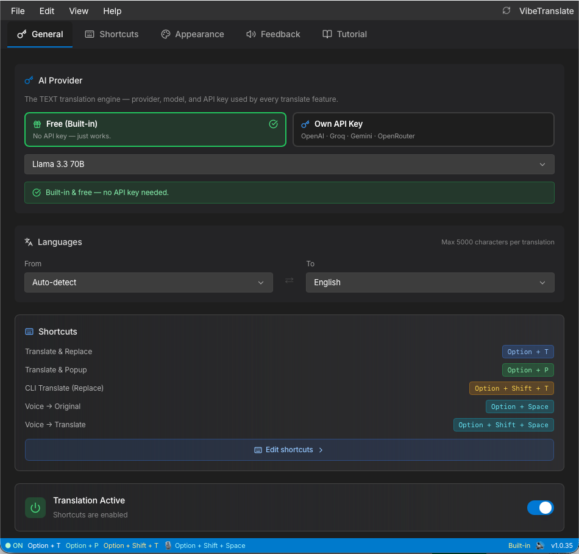

<p align="center">
  
</p>

<h1 align="center">VibeTranslate</h1>

<p align="center"><strong>AI translation + voice dictation for macOS &amp; Windows — free, and fully offline-capable.</strong></p>

<p align="center">
  Select text → shortcut → replaced instantly. &nbsp;Or 🎙️ speak → transcribe/translate → pasted at your cursor.
</p>

<p align="center">
  <a href="https://vibetranslate.id">Website</a> •
  <a href="https://vibetranslate.id/download">Download</a> •
  <a href="CONTRIBUTING.md">Contributing</a>
</p>

<p align="center">
  
  
  
  
</p>

<p align="center"><sub>🇮🇩 Dibuat di Indonesia — untuk yang berpikir dalam Bahasa Indonesia tapi menulis dalam bahasa Inggris.</sub></p>

---

<p align="center">
  
</p>

<p align="center"><sub>The free built-in engine is selected out of the box, so the first translation needs no setup.
The shortcuts in this screenshot have been customised — the defaults are in the table further down.</sub></p>

---

## ✨ Features

| | |
|---|---|
| 🔁 **Translate & Replace** | Select text → shortcut → the translation takes its place |
| 🪟 **Popup Translate** | Same, but the result opens in a small draggable window |
| 💻 **CLI Translate (Replace)** | For terminals & AI CLI agents (Claude Code, Droid, Codex) — the prompt line is replaced without ever interrupting a running task |
| 🎙️ **Voice → Translate** | Speak Indonesian, get English pasted at your cursor |
| 📝 **Voice → Dictation** | Speak, get your words as-is (optional AI cleanup for mishearings) |
| ✍️ **Enhance** | Fix grammar and clarity without translating |

Also: 11 languages with auto-detect, multi-monitor aware overlays, mouse-button shortcuts,
system tray, correction dictionary, microphone picker, Bahasa Indonesia + English UI.

## 🧠 How it works


Nothing is stored: text goes to the engine you chose and comes straight back to your cursor.

## 🔌 Engines

**Online** — zero setup with the built-in free server (fair-use daily quota), or bring your
own key for unlimited use (**Groq is free**), OpenAI, Gemini, OpenRouter, or any
OpenAI-compatible endpoint.

**Offline** — runs on your machine, no internet at all:

| Model | Size | Role |
|---|---|---|
| Omnilingual ASR 300M | 348 MB | Speech → text · 1,600+ languages incl. Indonesian |
| Whisper large-v3-turbo | 987 MB | Speech → text · highest accuracy, with punctuation |
| Parakeet TDT v3 | 640 MB | Speech → text · English/European specialist |

Speech-to-text therefore works with no internet at all. (Offline *text* translation via
NLLB-200 exists in the code but has no installer yet — the option only appears once the
model is present, so you will not see it in a normal install.)

## ⌨️ Shortcuts

Defaults (all customizable in **Settings → Shortcuts**):

| Action | macOS | Windows |
|--------|-------|---------|
| Translate & Replace | `Cmd+Alt+T` | `Ctrl+Alt+T` |
| Translate & Popup | `Cmd+Alt+P` | `Ctrl+Alt+P` |
| CLI Translate (Replace) | `Cmd+Alt+Shift+T` | `Ctrl+Alt+Shift+T` |
| Enhance & Replace | `Cmd+Alt+E` | `Ctrl+Alt+E` |
| Voice → Translate | `Cmd+Alt+V` | `Ctrl+Alt+V` |
| Voice → Dictation | `Cmd+Alt+Shift+V` | `Ctrl+Alt+Shift+V` |

## 📦 Install

Get it from [vibetranslate.id/download](https://vibetranslate.id/download) or [Releases](../../releases).

- **macOS** — open the DMG, drag to Applications, then grant **Accessibility** when prompted
  (needed to copy the selection and paste the result). Microphone is only requested for voice.
- **Windows** — run the installer or the portable `.exe`. Lives in the system tray.

The installers are **not code-signed or notarized** (an Apple Developer account is $99/year
and Windows certificates are a recurring cost). So the first launch needs one extra step:

- **macOS** — open the app once and let it be blocked, then go to **System Settings → Privacy
  & Security**, scroll to **Security**, and click **Open Anyway**. Control-clicking the app no
  longer works for this: Apple removed that override in macOS Sequoia. Do not run
  `sudo xattr -cr` — it strips every extended attribute from the whole bundle, which is a far
  bigger hammer than the situation needs.
- **Windows** — click **More info → Run anyway** on the SmartScreen prompt. On a machine with
  Smart App Control in enforcement mode there is no override, and the app cannot be installed
  until it is signed.

Being unsigned means more than a warning: there is no OS-level integrity check on the app
after install. Updates are a separate matter and are protected — every release is signed with
the project's own minisign key, and the app refuses any update it cannot verify.

## 🛠️ Development

```bash
pnpm install
pnpm tauri:dev      # run in dev
pnpm build:local    # build installers (dmg / nsis / msi)
```

Prerequisites: Rust, Node.js 22.13+ and pnpm 11. Windows also needs Visual Studio C++ Build Tools.
A build from source is fully functional — including the built-in free server.

Two things that will otherwise waste your afternoon:

- Use `pnpm build:local`, not `pnpm tauri build`. The plain command also produces *updater*
  artifacts, which have to be signed with the maintainer's private key, so it fails for
  everyone else. `build:local` turns that off and builds the same installers.
- The dev server pins port **1420** on purpose (it is the port the free built-in engine's CORS
  allowlist knows). If something else already holds it, `pnpm tauri:dev` fails loudly rather
  than silently moving — set `VITE_DEV_PORT=1421 pnpm tauri:dev` if you need another one.

## 🌐 What the app sends, and where

An app that holds Accessibility permission owes you a straight answer:

| You use | What leaves your machine |
|---|---|
| **Built-in free engine** | that request's text or audio → our API → the AI provider → back to you |
| **Your own API key** | the same, but straight to your provider — our servers are not involved |
| **An offline speech model** | nothing — *unless* the model fails to load, in which case the audio falls back to your configured engine |

Plus a status check on launch and on focus (at most once per 5 minutes), and the updater's
version check. Nothing is stored on our side, the free server is rate-limited by IP which is
not retained, and your API keys never leave your machine.

Two caveats worth knowing. "Offline" covers speech-to-text only: **Voice → Translate** and the
optional AI cleanup still send the transcript out, so for a hard guarantee use **Voice →
Dictation** with cleanup off. And the status endpoint carries a `freeMode` flag — `true`
today; were it ever `false`, this build would ask for a licence key. Said here rather than
left to be found in `src/hooks/useAppStatus.ts`, and being AGPL you can fork it out.

## 🤝 Contributing

Issues and pull requests are welcome — start with [`good first issue`](../../issues?q=label%3A%22good+first+issue%22).
Every PR runs typecheck + macOS/Windows builds automatically and is reviewed by hand before
merging. See [CONTRIBUTING.md](CONTRIBUTING.md).

## 🧱 Stack

Tauri 2 · React 19 + TypeScript · Rust · Tailwind CSS · sherpa-onnx (offline speech).

## 📄 License

[AGPL-3.0](LICENSE) — fork and modify freely, as long as your version stays open under the
same license. **The "VibeTranslate" name and logo are trademarks of the author**; forks must
use their own name and branding.

The server side (free translation/transcription API, admin panel) is a separate, closed
service and is not part of this repository. The app remains fully usable with your own API
key or the offline models.

---

© VibeTranslate — [vibetranslate.id](https://vibetranslate.id)
