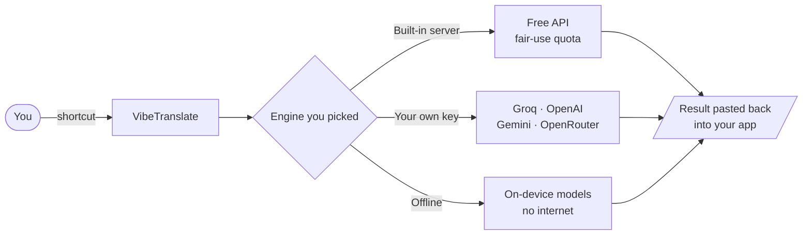

<p align="center">
  
</p>

<h1 align="center">VibeTranslate</h1>

<p align="center"><strong>AI translation + voice dictation for macOS &amp; Windows — free, and fully offline-capable.</strong></p>

<p align="center">
  Select text → shortcut → replaced instantly. &nbsp;Or 🎙️ speak → transcribe/translate → pasted at your cursor.
</p>

<p align="center">
  <a href="https://vibetranslate.id">Website</a> •
  <a href="https://vibetranslate.id/download">Download</a> •
  <a href="CONTRIBUTING.md">Contributing</a>
</p>

<p align="center">
  
  
  
  
</p>

<p align="center"><sub>🇮🇩 Dibuat di Indonesia — untuk yang berpikir dalam Bahasa Indonesia tapi menulis dalam bahasa Inggris.</sub></p>

---

## ✨ Features

| | |
|---|---|
| 🔁 **Translate & Replace** | Select text → shortcut → the translation takes its place |
| 🪟 **Popup Translate** | Same, but the result opens in a small draggable window |
| 💻 **CLI Translate (Replace)** | For terminals & AI CLI agents (Claude Code, Droid, Codex) — the prompt line is replaced without ever interrupting a running task |
| 🎙️ **Voice → Translate** | Speak Indonesian, get English pasted at your cursor |
| 📝 **Voice → Dictation** | Speak, get your words as-is (optional AI cleanup for mishearings) |
| ✍️ **Enhance** | Fix grammar and clarity without translating |

Also: 11 languages with auto-detect, multi-monitor aware overlays, mouse-button shortcuts,
system tray, correction dictionary, microphone picker, Bahasa Indonesia + English UI.

## 🧠 How it works



Nothing is stored: text goes to the engine you chose and comes straight back to your cursor.

## 🔌 Engines

**Online** — zero setup with the built-in free server (fair-use daily quota), or bring your
own key for unlimited use (**Groq is free**), OpenAI, Gemini, OpenRouter, or any
OpenAI-compatible endpoint.

**Offline** — runs on your machine, no internet at all:

| Model | Size | Role |
|---|---|---|
| Omnilingual ASR 300M | 348 MB | Speech → text · 1,600+ languages incl. Indonesian |
| Whisper large-v3-turbo | 987 MB | Speech → text · highest accuracy, with punctuation |
| Parakeet TDT v3 | 640 MB | Speech → text · English/European specialist |

Speech-to-text therefore works with no internet at all. (Offline *text* translation via
NLLB-200 exists in the code but has no installer yet — the option only appears once the
model is present, so you will not see it in a normal install.)

## ⌨️ Shortcuts

Defaults (all customizable in **Settings → Shortcuts**):

| Action | macOS | Windows |
|--------|-------|---------|
| Translate & Replace | `Cmd+Alt+T` | `Ctrl+Alt+T` |
| Translate & Popup | `Cmd+Alt+P` | `Ctrl+Alt+P` |
| CLI Translate (Replace) | `Cmd+Alt+Shift+T` | `Ctrl+Alt+Shift+T` |
| Enhance & Replace | `Cmd+Alt+E` | `Ctrl+Alt+E` |
| Voice → Translate | `Cmd+Alt+V` | `Ctrl+Alt+V` |
| Voice → Dictation | `Cmd+Alt+Shift+V` | `Ctrl+Alt+Shift+V` |

## 📦 Install

Get it from [vibetranslate.id/download](https://vibetranslate.id/download) or [Releases](../../releases).

- **macOS** — open the DMG, drag to Applications, then grant **Accessibility** when prompted
  (needed to copy the selection and paste the result). Microphone is only requested for voice.
- **Windows** — run the installer or the portable `.exe`. Lives in the system tray.

The installers are **not code-signed or notarized** yet (an Apple Developer account and a
Windows certificate are paid, recurring costs). So the first launch needs one extra step:
on macOS right-click the app → **Open** → **Open** (double-clicking shows "damaged"), and on
Windows click **More info → Run anyway** on the SmartScreen prompt. Updates are a different
matter: every release is signed with the project's own key and the app refuses any update
it cannot verify.

## 🛠️ Development

```bash
pnpm install
pnpm tauri:dev      # run in dev
pnpm tauri build    # build installers (dmg / nsis)
```

Prerequisites: Rust, Node.js 22.13+ and pnpm 11. Windows also needs Visual Studio C++ Build Tools.
A build from source is fully functional — including the built-in free server.

## 🌐 Network & licensing (what the app talks to)

Being open source means being straight about this:

| When | What is sent | Where |
|---|---|---|
| On launch, and on window focus (max once per 5 min) | nothing but the request itself | `api.vibetranslate.id/api/status` — returns whether the free mode is on and an optional notice to display |
| You translate or dictate using the **built-in server** | the text or audio for that one request | our API → the AI provider → straight back to you |
| You translate or dictate using **your own key** | the text or audio | directly to the provider you configured — our servers are not involved |
| You use an **offline speech model** | audio stays on your machine — *unless* the local model fails, in which case it falls back to the engine you configured | see note below |
| Update check | current version | the updater manifest |

Nothing is stored on our side. The free server is rate-limited by IP address, which is used
for that check and not retained. Your API keys are kept locally and are never sent to us.

**About "offline":** offline models cover *speech-to-text*. Two things still leave your
machine even with one selected: **Voice → Translate** sends the transcript to a translation
engine (translating is what it does), and the optional AI cleanup in **Voice → Dictation**
does the same. And if a local model fails to load, the app falls back to the online engine
rather than dropping your recording. If you want a hard guarantee that nothing leaves,
use **Voice → Dictation** with AI cleanup off.

**One thing to know:** the status endpoint carries a `freeMode` flag. It is `true` today and
the app is free. If it were ever set to `false`, this build would ask for a license key
instead of running. That switch is server-side and is disclosed here deliberately rather
than left for you to find in `src/hooks/useAppStatus.ts` — where you are welcome to read
exactly what it does. Being AGPL, you are also free to fork and remove it.

## 🤝 Contributing

Issues and pull requests are welcome — start with [`good first issue`](../../issues?q=label%3A%22good+first+issue%22).
Every PR runs typecheck + macOS/Windows builds automatically and is reviewed by hand before
merging. See [CONTRIBUTING.md](CONTRIBUTING.md).

## 🧱 Stack

Tauri 2 · React 19 + TypeScript · Rust · Tailwind CSS · sherpa-onnx (offline speech).

## 📄 License

[AGPL-3.0](LICENSE) — fork and modify freely, as long as your version stays open under the
same license. **The "VibeTranslate" name and logo are trademarks of the author**; forks must
use their own name and branding.

The server side (free translation/transcription API, admin panel) is a separate, closed
service and is not part of this repository. The app remains fully usable with your own API
key or the offline models.

---

© VibeTranslate — [vibetranslate.id](https://vibetranslate.id)
